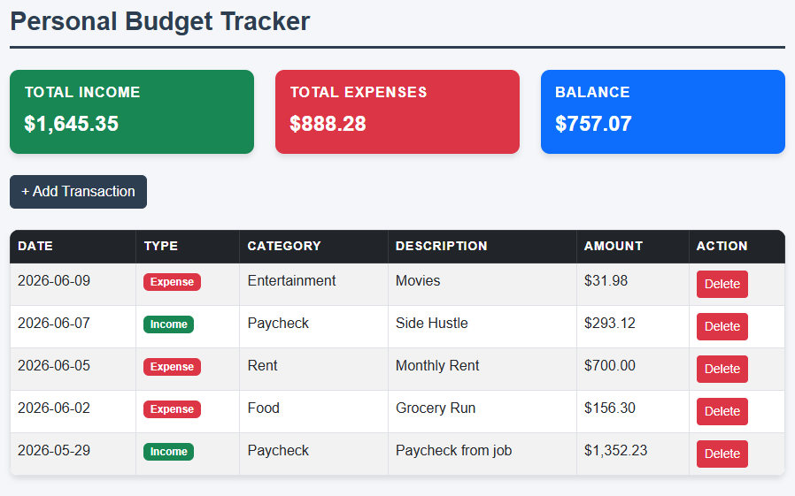

# Personal Budget Tracker

A full stack web application for tracking personal income and expenses, built with PHP, MySQL, and Bootstrap 5.

---

## Features

- Log income and expense transactions with category, amount, description, and date
- Live summary of total income, total expenses, and current balance
- Balance card changes color based on whether you are positive or negative
- Delete transactions with a confirmation prompt

---

## Tech Stack

- **Frontend:** HTML, CSS, Bootstrap 5
- **Backend:** PHP
- **Database:** MySQL
- **Local Development:** XAMPP

---

## How to Run Locally

1. Install [XAMPP](https://www.apachefriends.org)
2. Clone the repo and move the folder into `C:\xampp\htdocs\`
3. Start **Apache** and **MySQL** in XAMPP Control Panel
4. In phpMyAdmin, create a database called `budget_tracker` and run the SQL in `setup.sql`
5. Visit `http://localhost/budget-tracker`

---

## Concepts Demonstrated

- Full stack development with PHP and MySQL
- Create/Read/Update/Delete operations with server side validation
- SQL aggregation queries for live balance calculation
- Responsive UI with Bootstrap 5
- Database connection with a dedicated `db.php`

---

*Built as a portfolio project*